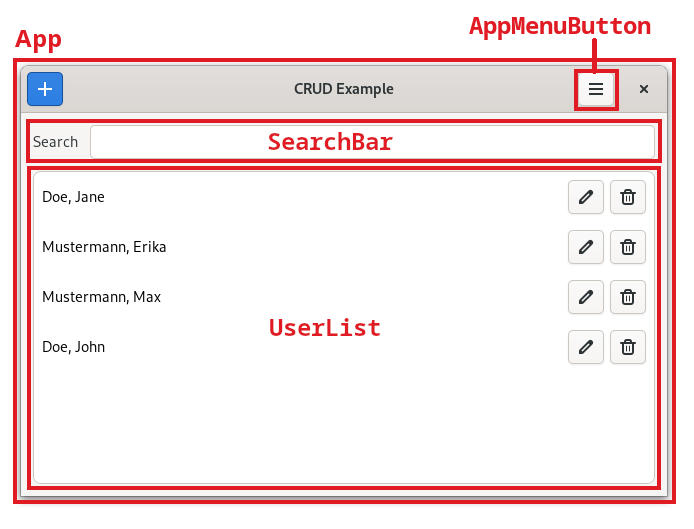
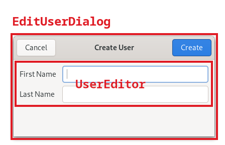

# Owlkettle CRUD Example

A simple CRUD (Create, Read, Update, Delete) example application created using [owlkettle](https://github.com/can-lehmann/owlkettle).
It uses `owlkettle` for creating the user interface and `tiny_sqlite` for storing the entities.


The application manages a list of users.
Each user has a first and last name as well as an automatically generated ID.
The users are saved in an SQLite database.

## Installation

Running this example requires that `GTK4` is installed on your system.
See [the owlkettle installation guide](https://github.com/can-lehmann/owlkettle#installation) for more details.

```bash
$ git clone https://github.com/can-lehmann/owlkettle-crud
$ cd owlkettle-crud
$ nimble install owlkettle@#head
$ nimble install tiny_sqlite
$ nim compile -r src/main.nim
```

## Project Structure

The architecture of the application consists of two parts:
The `model` defines the `User` entity and the `UserModel` object which is used to manage all `User` entities.
The `view` specifies the owlkettle widgets used to display the users in a GUI.

The following shows the directory structure of the project:

- **src**: Main source files for the application
  - **model**: The data model
    - [user_model.nim](src/model/user_model.nim): `UserModel`, `User`, `UserId`
  - **view**: The custom widgets defined by the application
    - [user_list.nim](src/view/user_list.nim): `UserList` widget
    - [search_bar.nim](src/view/search_bar.nim): `SearchBar` widget
    - [edit_user_dialog.nim](src/view/edit_user_dialog.nim): `EditUserDialog`
    - [user_editor.nim](src/view/user_editor.nim): `UserEditor` widget
    - [app_menu_button.nim](src/view/app_menu_button.nim): `AppMenuButton` widget
  - [main.nim](src/main.nim): Entry point for the application and `App` widget
- **assets**: Images used for documentation

## Widgets

The following screenshots show how the custom widgets defined in src/view are used in the application.



The `EditUserDialog` is used for creating and updating users.
See [edit_user_dialog.nim](src/view/edit_user_dialog.nim) for details.



## Funding

The funding for this example was donated by itwrx.org ([@ITwrx](https://github.com/ITwrx)).

## License

This example is licensed under the MIT license.
See `LICENSE.txt` for more information.
